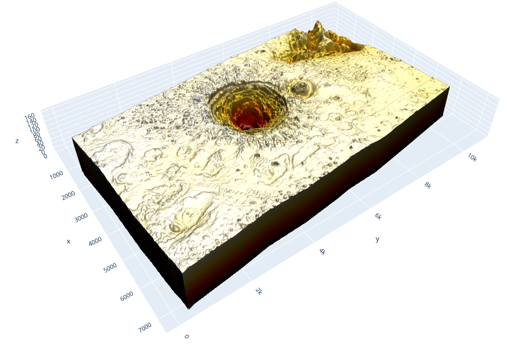
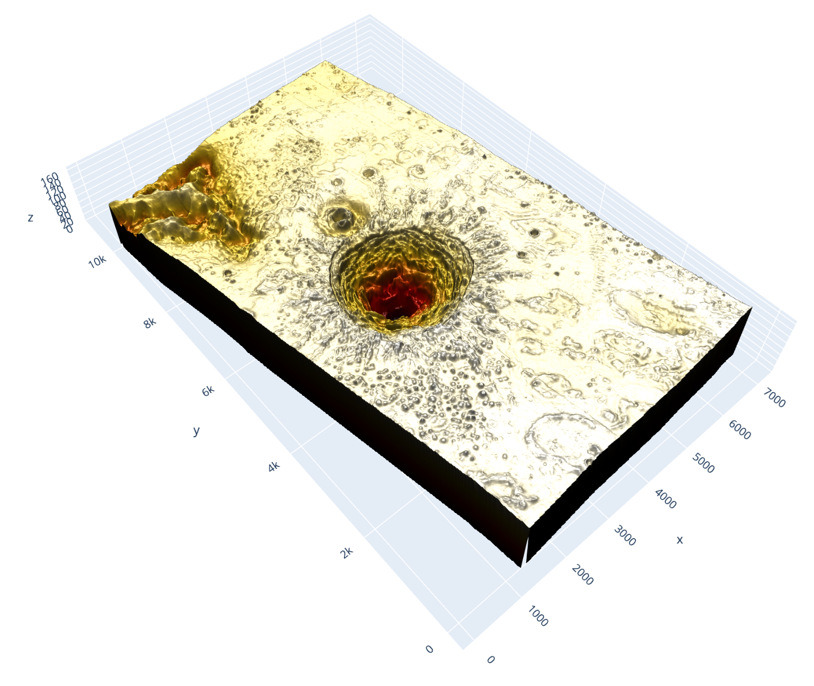
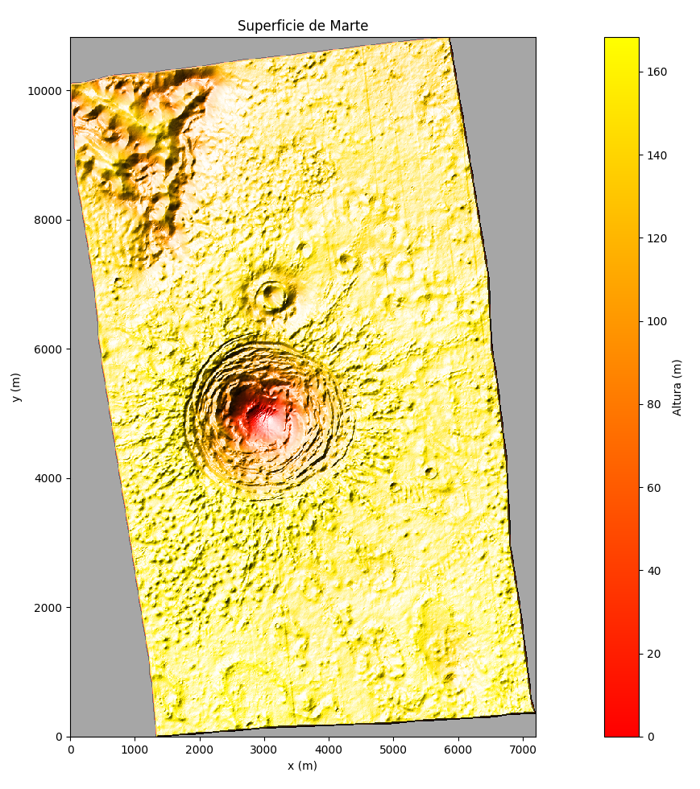
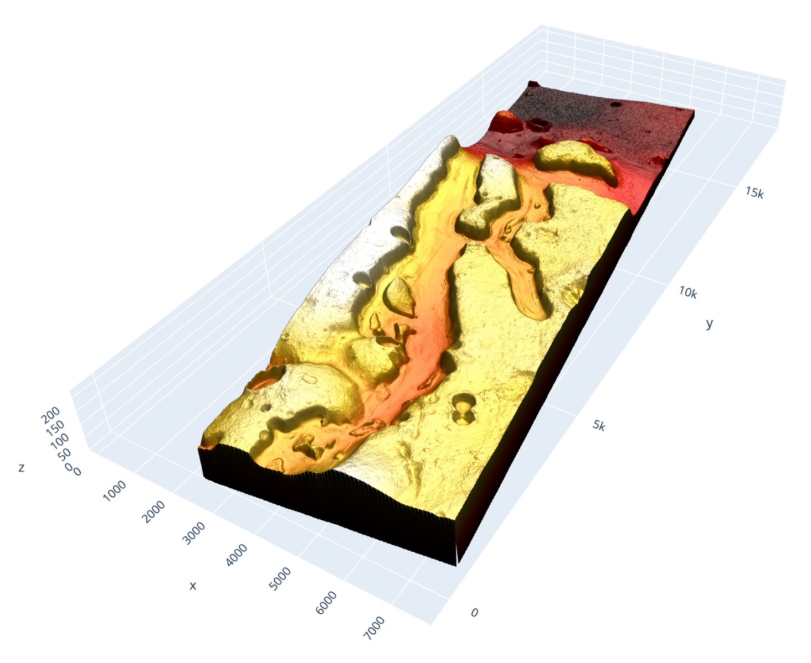
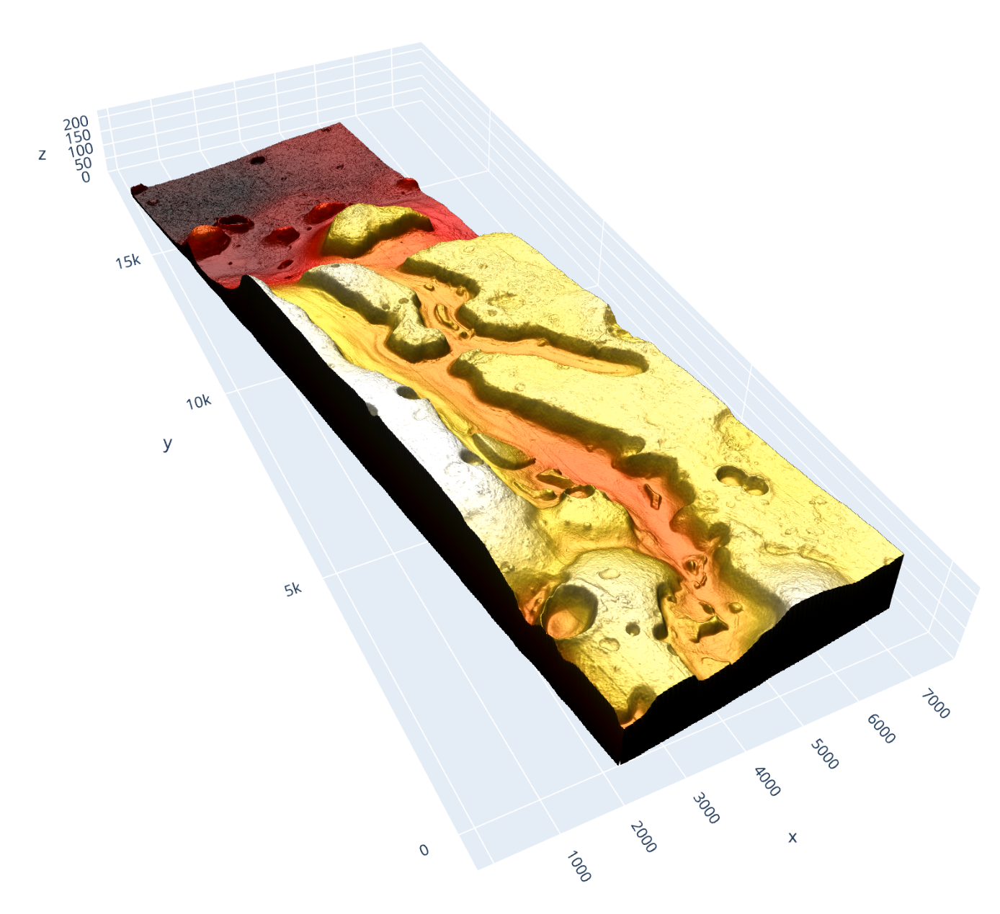
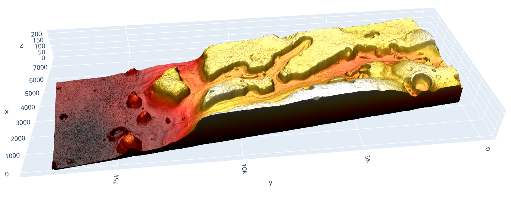
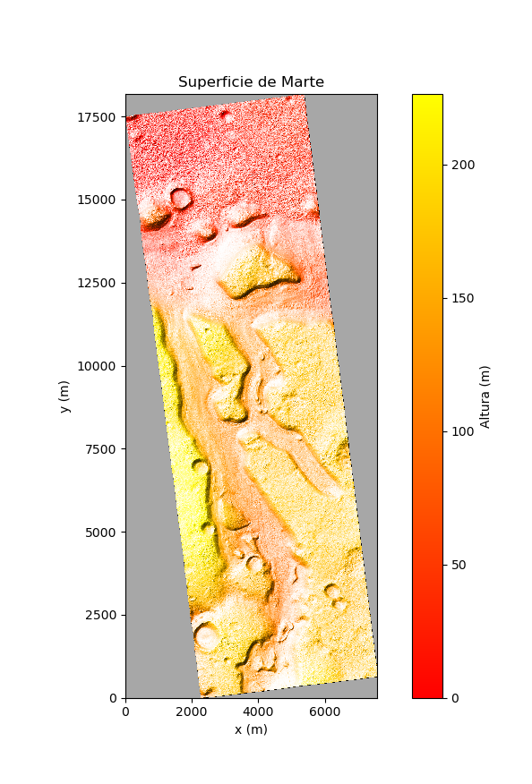

# Proyecto Integrador – Exploración en Marte

## Preparación
### Preprocesamiento obligatorio

Antes de ejecutar los notebooks de búsqueda, es **necesario** tener el archivo [mars_map-1.IMG](https://drive.google.com/file/d/19Glydt7cA0u81fvxf_JN2infhTuFJozx/view?usp=sharing) correr el script y asi generar `mars_map.npy`:

```bash
python height_map_preprocessing-1.py
```

## 1. Descenso al fondo de un cráter en Marte

### Objetivo
Emplear algoritmos de **búsqueda local** para encontrar rutas de descenso hacia el fondo de un cráter marciano.

### Contexto
Se teoriza que en el fondo de algunos cráteres de Marte podría haber agua u otros elementos de interés científico.

El reto consiste en simular cómo un rover podría descender de forma segura, considerando que:
- Cada píxel representa un área de **10.045 m × 10.045 m**.  
- El rover **solo conoce las profundidades de sus 8 vecinos inmediatos (vecindad 8)**.  
- No se permite moverse a píxeles con una diferencia de altura mayor a **2.0 m**.  

## Imagenes





### Algoritmos a implementar
#### 🔹 Búsqueda codiciosa (Greedy local)
1. En cada paso, evaluar los 8 vecinos.  
2. Elegir el píxel con la menor profundidad, siempre que la diferencia de altura ≤ 2.0 m.  
3. Repetir hasta no encontrar mejora posible.  

**Pruebas sugeridas:**  
- Iniciar en `(x=3350, y=5800)`.  
- Probar otras 5 posiciones, cercanas y lejanas al fondo.  

Preguntas a responder:
- ¿Hasta dónde llega el explorador?  
- ¿Qué tan bueno es el algoritmo en distintos casos?  

#### 🔹 Recocido simulado (Simulated Annealing)
1. Desde la posición actual, seleccionar aleatoriamente un vecino válido (Δh ≤ 2.0 m).  
2. Si mejora la solución, moverse.  
3. Si no mejora, aceptar la posición con probabilidad controlada por la **temperatura T**.  
4. Reducir gradualmente T hasta 0.  

**Pruebas sugeridas:**  
- Usar las mismas posiciones iniciales que con la búsqueda codiciosa.  
- Comparar cuál algoritmo llega más profundo.  

**Reflexión:**  
- ¿Qué algoritmo recomendarían a los ingenieros del rover?  

---

## 2. Planeación de rutas para la exploración en Marte

### Objetivo
Utilizar algoritmos de **búsqueda ciega e informada** para planear rutas de un rover hacia un objetivo en una superficie marciana con obstáculos.

### Contexto
- Datos obtenidos del satélite **HiRISE** (mapa de alturas).  
- Imagen escalada: **756 × 1814 píxeles**, cada píxel representa **10.0174 m × 10.0174 m**.  
- **Altura -1** indica píxeles inválidos (sin datos).  
- Sistema de coordenadas invertido en el eje vertical.  

Conversión de coordenadas:  
$$
r = n_r - \text{round}\!\left(\frac{y}{\text{escala}}\right), 
\quad 
c = \text{round}\!\left(\frac{x}{\text{escala}}\right)
$$

## Imagenes





### Algoritmos de búsqueda
- **Ciega (uninformed):** BFS, DFS.  
- **Heurística (informed):** Greedy, A*.  

**Restricciones:**  
- Movimiento en **vecindad 8**.  
- Diferencia máxima de altura permitida: **0.5 m**.  
- Píxeles con altura `-1` no son transitables.  

### Experimento 1: Ruta base
- Inicio: `(x=2850, y=6400)`  
- Meta: `(x=3150, y=6800)`  

Preguntas:  
- ¿Qué algoritmos encontraron ruta válida?  
- ¿Fue necesario usar búsquedas informadas?  
- ¿Qué heurística resultó adecuada?  

### Experimento 2: Distancias variables
Con un algoritmo elegido:  
- Rutas cortas (<100 m).  
- Rutas medias (300–800 m).  
- Rutas largas (>2000 m).  

Preguntas:  
- ¿En qué casos el algoritmo resolvió en tiempo aceptable?  
- ¿Qué hacer si no encuentra resultado?  

---
## Referencia
Los datos fueron sacados de [HiRISE](https://www.uahirise.org/dtm/)


## Entregables
- Notebooks con implementación de los algoritmos.  
- Tablas y gráficas de resultados.  
- Reflexión sobre desempeño y eficiencia de cada estrategia.  
